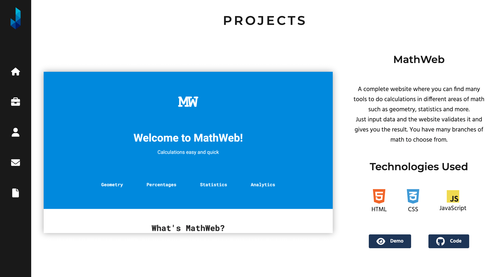
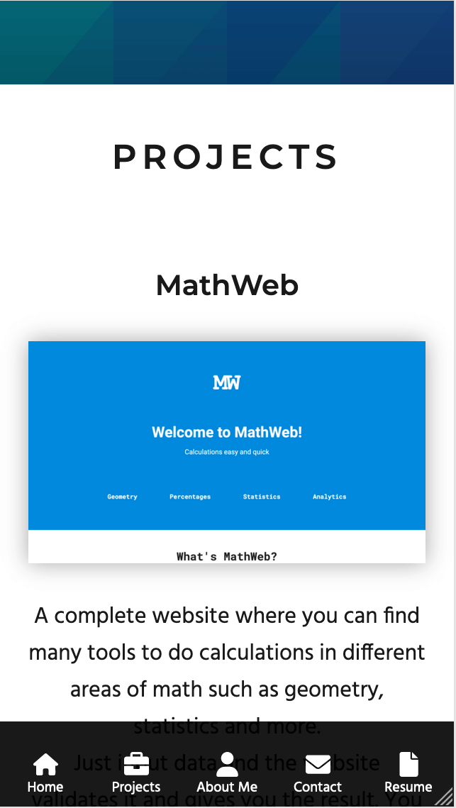
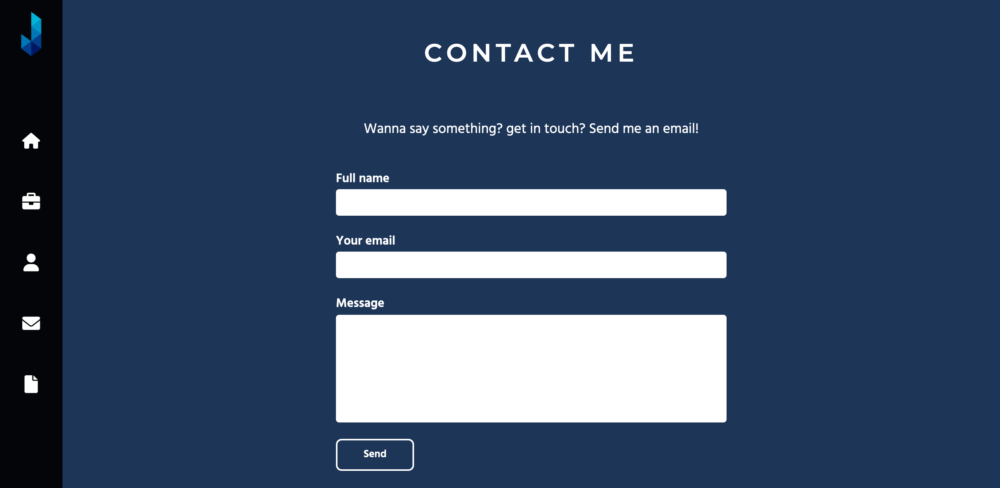

# Hello, **Josue Granados** here! This is my portfolio 🤘🏽 💻

I'm a frontend developer located in Mexico and this is my portfolio. It showcases the projects I have worked on and tells people who I am. I developed it with nothing but good HTML, CSS and JavaScript.

## Projects

All projects have a title, description, a list of technologies I used to build them and links to **live demos** and **GitHub repos**.

---

## It's responsive!

Tablet, Smartphone or PC it doesn't matter! You will have a great experience 😎

---

## Get in touch

Whether you just want to say _Hi!_ or contact me you have a form at the bottom of the page to send me a message (I will respond as soon as I can 😁).

